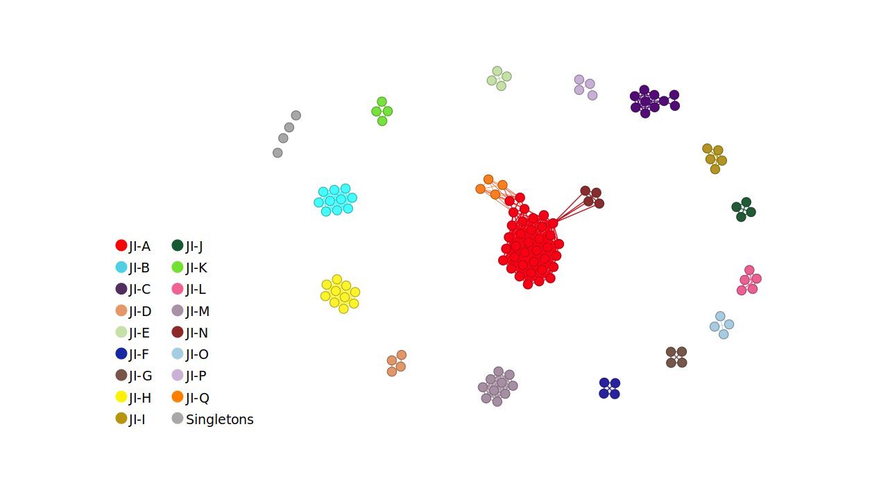

# Salmonella_Typhi_JINA
 Scripts for the Jaccard Index Network Analysis (JINA) of Salmonella Typhi

## How to install

### Dependencies
This pipeline consists of a collection of scripts written in bash, python, and perl Additionally, it utilizes several external programs to perform its tasks. The specific versions used during its development are listed below:

- Bindash 1.0
- Jellyfish 2.2.6

### Installation
Firstly, we need to download the proyect from GitHub:

~~~bash
# Change PROJECT_ROOT_DIRECTORY value to suit your preferences
PROJECT_ROOT_DIRECTORY='Salmonella_Typhi_JINA'
git clone https://github.com/PenilCelis/Salmonella_Typhi_JINA ${PROJECT_ROOT_DIRECTORY}
cd ${PROJECT_ROOT_DIRECTORY}
~~~

Create a conda environment for the dependencies:

~~~bash
conda env create -n typhi_JINA -f typhi_JINA.environment.yml
~~~

###Verify installation
Extract the test sequences and run the pipeline. The following command uses 16 threads and will compute the JI distances in batches of 32 genomes:

~~~bash
tar -Jxf test_seqs/test_seqs.tar.xz -C test_seqs/
./typhi_JINA_pipeline.sh test_seqs/genome_list.txt test_seqs test_out 16 32
~~~

Use Gephi to import the output files defining the network (```test_out/nodes.tsv``` and ```test_out/edges.tsv```) and filter the edges (```JI >= 0.983``` and ```GLD <= 0.05```). A Gephi file for the test network (```test_network.gephi```) colored by the clusters of the full Typhi dataset is provided with the proyect. The same is provided for the full Typhi dataset (```typhi_network.gephi```)


